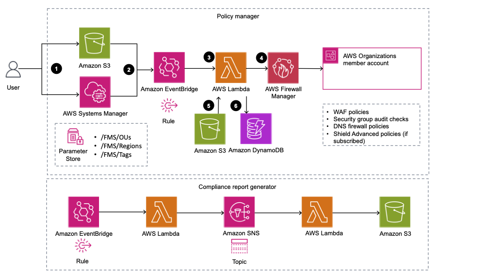

# Automations for AWS Firewall Manager

:grey_exclamation: Notice: This solution supersedes AWS Centralized WAF & VPC SG Management solution.
|-----------------------------------------|

**[🚀Solution Landing Page](https://aws.amazon.com/solutions/implementations/aws-firewall-mgr-automations-for-aws-orgs)** | **[🚧Feature request](https://github.com/aws-solutions/aws-firewall-manager-automations-for-aws-organizations/issues/new?assignees=&labels=feature-request%2C+enhancement&template=feature_request.md&title=)** | **[🐛Bug Report](https://github.com/aws-solutions/aws-firewall-manager-automations-for-aws-organizations/issues/new?assignees=&labels=bug%2C+triage&template=bug_report.md&title=)** | **[📜Documentation Improvement](https://github.com/aws-solutions/aws-firewall-manager-automations-for-aws-organizations/issues/new?assignees=&labels=document-update&template=documentation_improvements.md&title=)**

_Note:_ For any relevant information outside the scope of this readme, please refer to the solution landing page and implementation guide.

## Table of contents

- [Solution Overview](#solution-overview)
- [Architecture](#architecture)
- [Installation](#installing-pre-packaged-solution-template)
  - [Parameters](#parameters-for-prerequisite-template)
  - [Custom Policy](#custom-policy-stack)
- [Customization](#customization)
  - [Setup](#setup)
  - [Changes](#changes)
  - [Unit Test](#unit-test)
  - [Build](#build)
  - [Deploy](#deploy)
  - [Sample Customization Scenario](#sample-scenario)
- [File Structure](#file-structure)
- [License](#license)

## Solution Overview

The Automations for AWS Firewall Manager solution is intended for customers looking to easily manage consistent security posture across their entire AWS Organization. The solution uses AWS Firewall Manager Service.

Additionally, solution eases the installation process required to fulfill Firewall Manager prerequisites so customers can focus more on their organization security posture.

## Architecture

The default deployment of solution pre-packaged template deploys following infrastructure in your account. The architecture can be grouped into two separate workflows: **Policy manager** and **Compliance report generator**.



**Policy Manager**: The component is responsible for CRUD operations on the Firewall Manager security policies.

**Compliance Report Generator**: The component is responsible for generating compliance reports on your Firewall Manager security policies, in csv format.

## Installing pre-packaged solution template

- If you are already using Firewall Manager: [FMSAutomations.template](https://solutions-reference.s3.amazonaws.com/aws-firewall-manager-automations-for-aws-organizations/latest/aws-fms-automations.template)

- If you are new to Firewall Manager: [PreReq.template](https://solutions-reference.s3.amazonaws.com/aws-firewall-manager-automations-for-aws-organizations/latest/aws-fms-prereq.template)

- If you want to manage custom policies: [Policy.template](https://solutions-reference.s3.amazonaws.com/aws-firewall-manager-automations-for-aws-organizations/latest/aws-fms-policy.template)

- If you want to create demo resources: [Demo.template](https://solutions-reference.s3.amazonaws.com/aws-firewall-manager-automations-for-aws-organizations/latest/aws-fms-demo.template)

#### Parameters for fms-automation template

- **Compliance Reporting:** Do you want to generate compliance reports in csv format for your Firewall Manager policies. The reports are uploaded in a S3 bucket in your account and can be used for audit purposes.

#### Parameters for prerequisite template

- **Firewall Admin:** Provide the account-id to be used for Firewall Manager admin account. If you have already configured Firewall Manager admin, provide that account-id.
- **Enable Config:** Do you want to enable AWS Config across your Organization as part of pre requisite installation. You may chose 'No' if you already have Config enabled.

### Custom Policy Stack

There may be situations where you want to manage multiple Firewall Manager policy configurations. Let's say you want to apply policy configuration A to Organizational Units A1,A2,A3 in Region R1 and you want to apply policy configuration B to Organizational Units B1,B2,B3 in Region R2. To achieve this you may use nested [policy template](https://solutions-reference.s3.amazonaws.com/aws-firewall-manager-automations-for-aws-organizations/latest/aws-fms-policy.template) packaged with the solution.

- Step 1: deploy the [primary template](https://solutions-reference.s3.amazonaws.com/aws-firewall-manager-automations-for-aws-organizations/latest/aws-fms-automations.template)
- Step 2: deploy the [policy template](https://solutions-reference.s3.amazonaws.com/aws-firewall-manager-automations-for-aws-organizations/latest/aws-fms-policy.template) as many times as per the permutation and combination of Policy configuration, Organization Units and AWS Regions where you want to create the policies.
- Step 3: update the default policy manifest file that gets staged in the S3 bucket created with stack deployment from Step 2. Once you update the manifest file in S3 bucket, the next update of FMS policies will use the updated policy configurations from the manifest file.

The policy template requires following parameters:

- Policy Identifier: A unique string identifier for the policies, eg. ProductionPolicy

_Value for other parameters **Policy Table**, **Metric Queue** and **UUID** can be found out from output section of primary FMS automations stack_

For more details on custom policy template, read here in the [implementation guide](https://docs.aws.amazon.com/solutions/latest/aws-firewall-manager-automations-for-aws-organizations/customize-policies.html)

## Customization

- Prerequisite: Node.js=16

### Setup

Clone the repository and run the following commands to install dependencies, format and lint as per the project standards

```
npm i
npm run prettier-format
npm run lint
```

### Changes

You may make any needed change in the source code as per your requirement. (Eg. [Sample Scenario](#sample-scenario))

You can customize the code and add any extensibility to the solution. Please review our [feature request guidelines](./.github/ISSUE_TEMPLATE/feature_request.md), if you want to submit a PR.

### Unit Test

You can run unit tests with the following command from the root of the project

```
 npm run test
```

### Build

You can build lambda binaries with the following command from the root of the project

```
 npm run build
```

### Deploy

Run the following command from the root of the project

```
cd source/resources
npm i
```

Bootstrap your CDK environment

```
cdk bootstrap --profile <PROFILE_NAME>
```

The solution has following CDK Stacks

- Primary FMS Stack: this stack deploys all the primary solution components needed to manage Firewall Manager security policies. **Deploy in Firewall Manager Admin Account**

```
cdk synth CommonResourceStack
cdk deploy CommonResourceStack --profile <PROFILE_NAME>
```

- Prerequisite Stack: this stack can be used to fulfill solution prerequisites. **Deploy in Organizations Management Account**

```
cdk synth PreReqStack
cdk deploy PreReqStack --parameters FMSAdmin=<ACCOUNT_ID> --parameters EnableConfig=<Yes|No> --profile <PROFILE_NAME>
```

- Demo Stack: this stack can be used to provision minimal resources for demo purposes. You may deploy this stack in any account. **Deploy in us-east-1 only**

```
cdk synth DemoStack
cdk deploy DemoStack --profile <PROFILE_NAME>
```

_Note:_ for PROFILE_NAME, substitute the name of an AWS CLI profile that contains appropriate credentials for deploying in your preferred region.

### Sample Scenario

The default deployment uses opinionated values as setup in [policy manifest file](./source/resources/lib/policy_manifest.json). In this scenario let's say we want to update the global WAF policies default and turn-off the auto-remediation behavior. We can make the change as seen below and turn **remediationEnabled** to _false_.

```
 "policyName": "FMS-WAF-01",
 "policyScope": "Global",
 "resourceType": "AWS::CloudFront::Distribution",
 "remediationEnabled": false,
```

After making needed changes in the policy manifest, we need to update [policy stack](./source/resources/lib/policy.ts) so that the solution uses our customized local copy of policy manifest. For this, you can un-comment the following snippet in policy.ts; And comment-out/remove the AWSCustomResource('CopyManifest') code block that downloads policy manifest from aws-solutions S3 bucket.

```
new BucketDeployment(this, "CopyManifest", {
  sources: [
    Source.asset(`${path.dirname(__dirname)}/lib`, {
      exclude: ["**", "!policy_manifest.json"],
    }),
  ],
  destinationBucket: policyBucket,
  prune: true,
});

```

Additionally, if you want to control sending solution usage metrics to aws-solutions, you can refer to [solution manifest file](./source/resources/lib/solution_manifest.json).

```
"solutionVersion": "%%VERSION%%", #provide a valid value eg. v1.0
"sendMetric": "Yes",
```

## File structure

Automations for AWS Firewall Manager solution consists of:

- cdk constructs to generate needed resources
- prereq manager to validate and install Firewall Manager prerequisites
- policy manager to install FMS security policies
- metrics manager to publish metrics to aws-solutions
- compliance generator to generate compliance reports on FMS policies

<pre>
|-deployment/
  |build-scripts/                 [ build scripts ]
|-source/
  |-resources
    |-bin/
      |-app.ts                    [ entry point for CDK app ]
    |-__tests__/                  [ unit tests for CDK constructs ] 
    |-lib/
      |-common.ts                 [ CDK stack for common shared resources ]
      |-compliance.ts             [ CDK stack for compliance generator resources]
      |-policy.ts                 [ CDK stack for policy management and related resources ]
      |-iam.ts                    [ CDK construct for iam permissions for policy manager microservice ]
      |-prereq.ts                 [ CDK stack for FMS pre-requisite installation and validation related resources ]
      |-demo.ts                   [ CDK stack for demo resources ]
      |-policy_manifest.json      [ manifest file with default policy configuration ]
      |-solution_manifest.json    [ manifest file with solution configurations ]
      |-exports.ts                [ exports for CDK constructs ]
    |-config_files                [ tsconfig, jest.config.js, package.json etc. ]
  |-services/
    |-helper/                     [ lambda backed helper custom resource to help with solution launch/update/delete ]
    |-policyManager/              [ microservice to manage FMS security policies ]
      |-__tests/                  [ unit tests for all policy managers ]   
      |-lib/
        |-exports.ts              [ exports for Policy Manager class ]
        |-Validator.ts            [ class implementing facade patter for different validator classes ]
        |-OUValidator.ts          [ validator class to validator organizational units ]
        |-RegionValidator.ts      [ validator class to validate regions ]
        |-TagValidator.ts         [ validator class to validate tags ]
        |-PolicyEngine.ts         [ entry class to trigger policy handler workflows ]
        |-PolicyHandler.ts        [ class to perform CRUD operations on FMS policies ]
        |-PolicyHelper.ts         [ class with helper methods for FMS policies ]
        |-waitForDNSFirewallR.ts  [ waiter to wait for DNS Firewall rule group state transition to NOT_SHARED ]
      |-index.ts                  [ entry point for lambda function]     
      |-config_files              [ tsconfig, jest.config.js, package.json etc. ]
    |-preReqManager
      |-__tests/                  [ unit tests for pre req manager ] 
      |-lib/ 
        |-clientConfig.json       [ config for AWS service clients ]
        |-preReqManager.ts        [ class for FMS pre-requisites validation and installation ]
      |-index.ts                  [ entry point for lambda function]     
      |-config_files              [ tsconfig, jest.config.js, package.json etc. ]   
    |-metricsManager
      |-index.ts                  [ entry point for lambda function]     
      |-config_files    
    |-complianceGenerator
      |-lib/
        |-complianceGenerator.ts  [ class for FMS compliance generator ]
      |-index.ts                  [ entry point for lambda function]
      |-config_files
  |-config_files                  [ eslint, prettier, tsconfig, jest.config.js, package.json etc. ]  
</pre>

## Collection of operational metrics

This solution collects anonymous operational metrics to help AWS improve the quality and features of the solution. For more information, including how to disable this capability, please see the [implementation guide](https://docs.aws.amazon.com/solutions/latest/aws-firewall-manager-automations-for-aws-organizations).

---

Copyright Amazon.com, Inc. or its affiliates. All Rights Reserved.

Licensed under the Apache License Version 2.0 (the "License"). You may not use this file except in compliance with the License. A copy of the License is located at

```
http://www.apache.org/licenses/
```

or in the ["license"](./LICENSE.txt) file accompanying this file. This file is distributed on an "AS IS" BASIS, WITHOUT WARRANTIES OR CONDITIONS OF ANY KIND, express or implied. See the License for the specific language governing permissions and limitations under the License.
